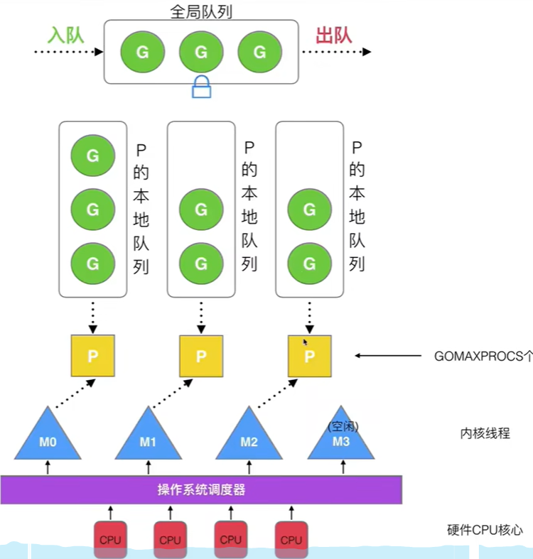

## Go basics

### 导入本地包

#### **1. 创建模块**

1. **初始化模块**：

   - 在本地创建模块目录并初始化：

   ```
   mkdir mymodule
   cd mymodule
   go mod init mymodule
   ```

2. **创建代码文件**：

   - 创建一个 `hello.go` 文件，编写模块的功能：

   ```
   package mymodule
   
   import "fmt"
   
   func SayHello(name string) {
       fmt.Printf("Hello, %s!\n", name)
   }
   ```

3. **生成可导入的本地模块**：

   - 确保模块代码能够正常工作，`mymodule` 是模块路径。

#### 2.在另一个项目中导入本地模块

* **1.创建新项目**：

  - 新建一个项目目录：

  ```
  mkdir myproject
  cd myproject
  go mod init myproject
  ```

* **编辑模块依赖**：

  - 在 `myproject` 中指向本地模块的路径： 

  ```
  go mod edit -replace=mymodule=../mymodule
  ```

  * 此时go.mod文件中会添加

    * ```go
      replace mymodule => ../mymodule
      ```

* **创建调用代码**：

  - 在项目中调用模块：

  ```
  package main
  
  import "mymodule"
  
  func main() {
      mymodule.SayHello("World")
  }
  ```

* **同步依赖**：

  - 使用 `go mod tidy` 同步依赖，验证模块可以正常引用：

  ```
  go mod tidy
  ```

  * ```go
    replace mymodule => ../mymodule	
    
    // 执行go mod tidy添加
    require mymodule v0.0.0-00010101000000-000000000000
    ```

  * 上述两行代码页可以手动添加到 go.mod 文件中

* **运行项目**：

  - 在项目目录下运行代码：

  ```
  go run main.go
  ```

* 本地目录结构：

  * ```
    /path/to/projects/
    ├── mymodule/
    │   ├── go.mod
    │   ├── hello.go
    ├── myproject/
        ├── go.mod
        ├── main.go
    ```

### 打印控制

* `%q`：带引号输出字符串。

### 值类型和引用类型

* go中的基本数据类型

  * ```go
    int uint 
    
    float32 float64
    
    complex64 complex128
    
    bool
    
    string
    ```

* go中的复合类型

  * ```go
    普通数组
    
    slice
    
    map
    
    chan
    
    struct
    
    函数
    ```

* 值类型：

  * 赋值或传递时，会进行**值的拷贝**，新的变量与原变量互不影响。

  * 每个变量都有自己独立的内存空间。

  * ```
    int, float, string, array, struct
    ```

* 引用类型

  * 赋值或传递时，会进行**地址的拷贝**，多个变量指向同一块内存。

  * 修改一个变量的值，会影响其他指向相同地址的变量。

  * ```
    pointer, slice, map, channel
    ```

* 

### byte (字符) 和 rune 类型

* `uint8`类型，也叫 `byte` 类型，代表 ASCII 的一个字符

* `rune` 类型，代表一个 UTF-8字符，实际是一个`int32`类型

* ```go
  var a = 'a'
  // 默认输出ASCII值
  fmt.Printf("a = %v, type a = %T\n", a, a)	// a = 97, type a = int32
  
  // 原样输出字符
  fmt.Printf("a = %c, type a = %T\n", a, a)	// a = a, type a = int32
  
  
  var str = "this"
  fmt.Printf("str[1] = %c, type str[1] = %T\n", str[1]	, str[1]) // str[1] = h, type str[1] = uint8
  
  // 一个汉字占用3个字节（UTF-8编码），一个字母占用1个字节（ASCII）
  fmt.Println(len(str))	// 4个字节
  
  var str2 = "你好go"
  fmt.Println(len(str2))	// 8个字节
  
  // 遍历字符串
  for i := 0; i < len(str); i++ {		// 字符默认使用 byte 类型
      fmt.Printf("%c %T | ", str[i], str[i])
  }
  fmt.Println()
  
  for _, c := range str {		// 默认使用 rune 类型
      fmt.Printf("%c %T | ", c, c)
  }
  fmt.Println()
  
  // 修改字符串
  // str[0] = 'c'	// error，不能直接修改
  byteStr := []byte(str)
  byteStr[0] = 'T'
  fmt.Println(string(byteStr))
  
  runeStr := []rune(str2)
  runeStr[0] = '不'
  fmt.Println(string(runeStr))
  ```

### 数组和切片（slice）

* 值类型：赋值和传参会拷贝整个变量或数组，改变副本，不会改变本身的值。 

* 引用类型：

* 数组的长度是编译时就确定的，不能更改。**基本数据类型和数组都是值类型**

* 切片是一个动态数组，可以在运行时改变大小。**切片是引用类型**

* ```go
  //数组
  var arr = [...]int{1, 2, 3, 4}	// 数组长度由元素数量推导得出
  var arr1 = [5]int{1, 2, 3, 4, 5}
  
  var arr = [3][2] string {
      {"zjnu", "qlu"},
      {"xxx", "bxx"},
      {"sdf", "hello"},
  }	
  
  fmt.Println(arr[0], arr[0][0])
  
  // 遍历二维数组
  for i := 0; i < len(arr); i++ {
      for j := 0; j < len(arr[i]); j++ {
          fmt.Printf("%v ", arr[i][j])
      }
      fmt.Println()
  }
  for _, val1 := range arr {
      for _, val2 := range val1 {
          fmt.Printf("%v ", val2)
      }
      fmt.Println()
  }
  ```

* ```go
  // 切片
  var arr = []int{1, 2, 3, 4}
  
  arr2 := make([]int, 5)
  
  //创建一个空的mxn的切片
  slice := make([][]int, m) // 创建一个有 m 行的切片
  // 为每一行分配 n 个元素
  for i := 0; i < m; i++ {
      slice[i] = make([]int, n) // 每行分配 n 个元素
  }
  
  ```

* 切片的引用行为

  * **切片本身是一个结构体**，包含以下内容：
    * 指向底层数组的指针。
    * 切片的长度。
    * 切片的容量。

* 当切片作为函数参数传递时，Go 会**按值拷贝切片结构体**。

  - 这意味着函数接收的是原切片结构体的副本，但该副本仍然指向相同的底层数组。
  - 修改副本的元素会反映到原始切片，因为它们共享底层数组。
  - **但如果修改切片的结构体本身（如重新分配底层数组或改变长度），则不会影响原始切片**。

#### 关于切片的 append 操作

* [Go切片append采坑经验分享](https://juejin.cn/post/7202984088184635447)

* ```go
  package main
  
  import "fmt"
  
  func main() {
  	var ans [][]string
  	path := []string{"a", "b"}
  
  	// Append by reference
  	ans = append(ans, path)
      
  	path[0] = "xx"
  	fmt.Println("ans: By reference:", ans) // [[a b c]]
  	fmt.Println("path:", path)
  
  	// Append by copying
  	ans = nil                 // Clear ans for comparison
  	path = []string{"a", "b"} // Reset path
  	ans = append(ans, append([]string(nil), path...))
  	path = append(path, "c")        // Modify path
  	fmt.Println("By copying:", ans) // [[a b]]
  }
  ```

  * `ans = append(ans, path)`：直接将 `path` 引用添加到 `ans` 中。如果后续修改了 `path` 的内容，则 `ans` 中对应的引用指向的内容也会改变。
  * `ans = append(ans, append([]string(nil), path...)`：创建了 `path` 的一个副本（深拷贝），然后将这个副本添加到 `ans` 中。
    * `[]string(nil)` 表示一个零长度、零容量的切片，它没有底层数组。
    * `path...` 是一个**切片展开操作**。它会将切片 `path` 中的元素拆开，传递给 `append` 函数。
  * **切片传值操作**，append未触发扩容，会同时修改底层数组的值，但不会影响原切片的长度和容量；当触发扩容，那么会产生副本，后面的修改则会和原底层数组剥离开，互不影响。

* ```go
  package main
  
  import "fmt"
  
  func main() {
  	path := []string{"a", "b"}
  	ans := [][]string{}
  
  	fmt.Printf("Before append, path address: %p\n", &path[0]) // 打印 path 的内存地址
  	ans = append(ans, path)                                   // 将 path 添加到 ans 中
  	fmt.Printf("After append, ans address: %p\n", &ans[0][0]) // 打印 ans 中第一个元素的内存地址
  
  	path = append(path, "c")                                 // 修改 path，增加了 "c"
  	fmt.Printf("After modify, path address: %p\n", &path[0]) // 打印修改后的 path 的内存地址
  
  	fmt.Println("ans: By reference:", ans) // 打印 ans
  
  	path[0] = "aa"
  	fmt.Println("path: By reference:", path) // 打印 ans
  	fmt.Println("ans: By reference:", ans)   // 打印 ans
  }
  //output:
  Before append, path address: 0xc000038040
  After append, ans address: 0xc000038040
  After modify, path address: 0xc00007c0c0
  ans: By reference: [[a b]]
  path: By reference: [aa b c]
  ans: By reference: [[a b]]
  ```

* 


### 运算符

* 在golang中，`++`和`--`只能单独使用

  * ```·
    var i int = 1
    var a int
    
    a = i++		// error
    
    
    ```

* golang中没有前置的`++`和`--`

  * ```go
    var i int = 1
    
    ++i		//error
    --i		// error
    ```

* 复合运算符

  * ```go
    += 
    -=
    *=
    /=
    %=
    ```

* 位运算符

  * ```
    &
    |
    ^
    <<
    >>
    ```

* `:=`

  * `:=` 会声明并初始化变量。

    * 如果左侧的变量已经在当前作用域中存在，则不会重新声明，而是直接复用这些变量。

    * 如果左侧有新的变量，那么会声明新的变量，同时复用已有的变量。

  * ```go
    // 情况1
    func main() {
        db, err := fun1()
        db1, err := fun2() // 复用 err，声明 db1
        fmt.Println(db, db1, err)
    }
    ```

  * ```go
    // 情况2
    func main() {
        db, err := fun1()
        {
            db1, err := fun2() // 这里的 err 是新的变量
            fmt.Println(db1, err)
        }
        fmt.Println(db, err) // 外层的 err 不受内层影响
    }
    ```

  * 


### 条件和循环语句

* ```go
  if score := 75; score > 90 {	// score 的用于位于if语句中
      fmt.Println("A")
  } else if score > 75 {
      fmt.Println("B")		
  } else {
      fmt.Println("C")
  }
  
  
  if x := 10; y := 20; x > y { 	// 编译报错：简单语句中不能包含多条语句
      fmt.Println("Invalid!")
  }
  ```

* ```go
  for i := 0; i < 5; ++i {
  	fmt.Println(i)
  }
  
  // go中没有while循环，使用 for 替代
  for i != 10 {
  	fmt.Println(i)
  	++i
  }
  ```

### 类型别名

* ```go
  type counter int
  
  package main
  
  import "fmt"
  
  // 定义一个基于 int 类型的自定义类型 counter
  type counter int
  
  func main() {
  	// 定义一个 int 类型的变量
  	var x int = 42
  	
  	// 定义一个 counter 类型的变量
  	var y counter = 100
  
  	// 类型转换：从 counter 转换为 int
  	fmt.Println(int(y)) // 输出: 100
  
  	// 类型转换：从 int 转换为 counter
  	y = counter(x)
  	fmt.Println(y) // 输出: 42
  }
  ```

* `counter` 是 `int` 类型的一个**别名**，但它和 `int` 在类型系统中是不同的类型。你不能直接将一个 `int` 类型的变量赋值给一个 `counter` 类型的变量，除非进行显式的类型转换。

* 

### Sprintf

* ```go
  int %d
  float %f
  bool %t
  byte %c
  
  // 其它类型转换为string类型
  var a int = 2
  var f float32 = 3.14
  var t bool = false
  var b byte = 1
  
  str1 := fmt.Sprintf("%d", a)
  str2 := fmt.Sprintf("%f", f)
  str3 := fmt.Sprintf("%t", t)
  str4 := fmt.Sprintf("%b", b)
  
  fmt.Println(str1, str2, str3, str4)	// 2 3.140000 false 1
  
  // 使用 strconv 将其它类型转换为string类型
  var a int = 2
  var f float32 = 3.141596
  var t bool = false
  var b byte = 1
  
  s1 := strconv.FormatInt(int64(a), 10)
  s2 := strconv.FormatFloat(float64(f), 'f', 2, 64)
  s3 := strconv.FormatBool(t)
  s4 := strconv.FormatUint('a', 10)
  
  fmt.Println(s1, s2, s3, s4)	// 2 3.14 false 97
  ```

* 

### struct

* ```go
  type Student struct {
  	Name string
  	Grade map[string]int
  }
  
  func main() {
      stu := Student{}
      /*
      stu.Grade["math"] = 90	// error:此时的stu.Grade是nil的，必须为其分配内存
      */
      
  	stu.Grade = make(map[string]int)
  	stu.Grade["math"] = 100
  	stu.Grade["chinese"] = 90
  	fmt.Printf("Name = %v, grade = %v\n", stu.Name, stu.Grade)
  }
  
  output:
  Name = , grade = map[chinese:90 math:100]
  ```

### string

* 使用 `+` 或 `Sprintf` 拼接字符串

### 结构体值接受者和结构体指针接收者的区别

* **接收者的命名通常为结构体名称的简写**，一般采用小写字母形式，常见的是结构体名称的第一个字母或前几个字母。

* **值接收者**是指通过结构体的副本来调用方法，也就是说，方法内修改的是结构体的一个副本，不会影响原始结构体。

  * **值接收者**对应的结构体实例化后的**结构体值类型或者指针类型**都可以赋值给**接口变量**

  * ```go
    package main
    
    import "fmt"
    
    type Ipoint interface {
    	Add(Point) Point
    }
    
    // 定义结构体
    type Point struct {
        X, Y int
    }
    
    // 使用值接收者定义方法
    func (p Point) Add(other Point) Point {
        return Point{p.X + other.X, p.Y + other.Y}
    }
    
    func main() {
        p1 := Point{1, 2}	// 结构体值类型
        p2 := &Point{3, 4}	// 结构体指针类型
    	var ip Ipoint = p1
    	result := ip.Add(*p2)
    	fmt.Println(result)
    }
    ```

  * 

* **指针接收者**是指通过结构体的指针来调用方法，即方法内的修改会直接影响原始结构体。指针接收者通常用于需要修改结构体内容的方法，或者结构体较大时为了提高性能（避免值拷贝）。

  * ```go
    package main
    
    import "fmt"
    
    type Ipoint interface {
    	Add(Point) Point
    }
    
    // 定义结构体
    type Point struct {
        X, Y int
    }
    
    // 使用指针接收者定义方法
    func (p *Point) Add(other Point) Point {
        return Point{p.X + other.X, p.Y + other.Y}
    }
    
    func main() {
        p1 := &Point{1, 2}	// 结构体指针类型
        p2 := Point{3, 4}	
    	var ip Ipoint = p1	// 正确，只能将结构体指针类型的对象赋值为接口
    	result := ip.Add(p2)
    	fmt.Println(result)
    }
    ```

  * 

### 断言

* 类型断言：

  * 1.单值形式：如果断言失败，程序会触发 panic，导致运行时错误。 `value := arg.(string)`

  * 2.多值形式（推荐）：如果断言失败，不会 panic，而是通过 ok 值告知调用者。` value, ok := arg.(string)`

* 1.具体类型断言：`str, ok := i.(string)`
  * i 是一个接口类型（如 interface{}），断言它是具体类型 string。 
* 2.接口类型断言：`w, ok := r.(io.Writer)`
  * r 是一个接口类型（如 interface{}），断言它实现了某个接口（这里是 io.Writer）。如果 r 的实际值是某个类型的值，并且该类型实现了 io.Writer 接口，断言成功，w 被赋值为 r 的值，ok = true。

### 函数

* 匿名函数可以直接在其作用域内使用外部变量。

* ```go
  package main
  
  import "fmt"
  
  func main() {
      // 外部变量
      base := 10
  
      // 匿名函数，直接访问外部变量
      increment := func() int {
          base++ // 修改外部变量
          return base
      }
  
      // 调用匿名函数
      fmt.Println(increment()) // 输出：11
      fmt.Println(increment()) // 输出：12
  }
  ```

* ```go
  func longestCommonSubsequence(text1 string, text2 string) int {
      m := len(text1)
      n := len(text2)
  
      dp := make([][]int, m + 1)
      for i := range dp {
          dp[i] = make([]int, n + 1)
          for j := range dp[i] {
              dp[i][j] = -1			// 初始化元素
          }
      }
  
      var dfs func(int, int) int
      dfs = func(i, j int) int {
          if i < 0 || j < 0 {
              return 0
          }
          res := &dp[i][j]
          if *res != -1 {
              return *res
          }
          if text1[i] == text2[j] {
              *res = dfs(i - 1, j - 1) + 1
          } else {
              *res = max(dfs(i - 1, j), dfs(i, j - 1)) 
          }
          return *res
      }
      return dfs(m - 1, n - 1) 
  }
  ```

* 

### select 

* **多个 case 同时满足条件**：当 `select` 中的多个 `case` 都可以立即执行时，Go 会随机选择一个执行，剩下的 case 会被跳过，直到下次执行时它们才有可能被选择。

* 如果没有 `case` 就绪，将会执行default处的语句（如果有的话）。如果没有default，`select` 会阻塞等待某一个 `case` 就绪。

* ```go
  func main() {
  	intChan := make(chan int, 5)
  	stringChan := make(chan string, 5)
  
  	for i := 0; i < 5; i++ {
  		intChan <- i
  	}
  
  	for i := 0; i < 5; i++ {
  		stringChan <- fmt.Sprintf("str%d", i) 
  	}
  
  	// 	前两个case 都是满足，因此会从中随机选择一个执行
  	for {
  		select {
  		case val := <-intChan:
  			fmt.Println("int = ", val)
  		case val := <-stringChan:
  			fmt.Println("string = ", val)
  		default:
  			fmt.Println("所有数据读取完毕...")	
  			return
  		}
  	}
  }
  ```

* 

### make和new的区别

* make 只能用于slice, map, channal，为对象分配内存，并返回该对象的引用类型本身。slice, map, channal 本身就是引用类型。

* new可用于任意类型，为对象分配内存并返回指向该对象的指针

  * 用于分配任何类型的内存，但**不会初始化**。
  * 返回一个指向类型的指针，类型中的值为**零值**（zero value）
  * **不常用**

* ```go
  // new
  var a *int
  a = new(int)	// 分配内存
  *a = 100
  
  
  
  // make
  slice := make([]int, 0, 100)
  hash := make(map[int]bool) 
  ch := make(chan int, 5)
  
  
  // the difference between new and make
  p := new(chan int)   // p has type: *chan int
  c := make(chan int)  // c has type: chan int
  ```

* ```go
  func main() {
  	
  	hash := make(map[string]int)
  	hash["nihao"] = 123
  	hash["hello"] = 456 
  	fmt.Printf("%v %T\n", hash, hash)
  	
  	// 使用 new 分配 map 的内存，得到一个 map 的指针
  	hash2 := new(map[string]int)
  	// 此时 *hash2 是 nil，需要用 make 初始化
  	*hash2 = make(map[string]int)
  
  	(*hash2)["nihao"] = 123
  	(*hash2)["hello"] = 456 
  	fmt.Printf("%v %T\n", *hash2, hash2)
  }
  ```

* 

### Goroutine

#### 用户级线程与内核级线程的区别

* **用户级线程（ULT）**：是由用户空间的线程库（如 `pthread` 库）管理和调度的，操作系统内核对这些线程并不知情。用户级线程的调度和管理完全由用户空间的线程库来完成，内核认为一个进程是一个线程，因此不会对这些线程的创建、销毁或调度做出任何直接的决策。
  - 优点：切换速度快，因为没有涉及内核的上下文切换。
  - 缺点：如果一个线程在用户空间阻塞（例如进行 I/O 操作），整个进程都会被阻塞，因为内核不知道该进程内有多个线程。
* **内核级线程（KLT）**：是由操作系统内核管理和调度的，内核知道进程内部有多个线程，并为每个线程分配独立的调度单位和资源。内核负责在 CPU 上调度这些线程，并处理它们的上下文切换。
  - 优点：内核能够独立调度各个线程，如果一个线程阻塞，其他线程可以继续执行。
  - 缺点：线程切换相对较慢，因为需要进行内核级的上下文切换。

#### goroutine

* 
* 调度器的设计策略
  * 复用线程
  * 利用并行：GOMAXPROCS限定P的个数=CPU核数/2
  * 抢占
  * 全局G队列
* for 循环中使用goroutine

  * 在循环中开启 goroutine，传递参数最好通过变量赋值，而不是利用函数闭包; **因为 goroutine 最终读取变量的时间是不确定的，从而 goroutine 中获取到变量的值不一定符合最初的预期。**
* **sender blocks until the receiver receives!**
* 

### Channel

* 使用 channel 同步两个 goroutine
* 

* 无缓冲的channel
  * `c := make(chan int)`
* 有缓冲的channel
  * `c := make(chan int, 3)`


### Rpc

* 远程过程调用（remote procedure call）
  * 运行在一台计算机的程序调用另一个地址空间（通常为网络上的另一台计算机）的程序。
  * 是一种**进程间通信**的模式，程序分布于不同的地址空间（同一台计算机/不同计算机）。
  * [Rpc definition](https://www.geeksforgeeks.org/remote-procedure-call-rpc-in-operating-system/)

* 

* 
* 

### Go-即时通讯系统

* 

* 